[TOC]
## 系统架构
### 功能模块
.png)
### 技术架构
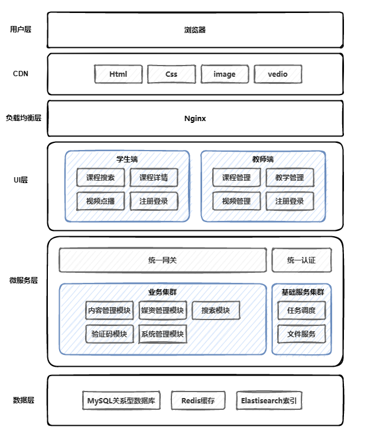
### 工程模块
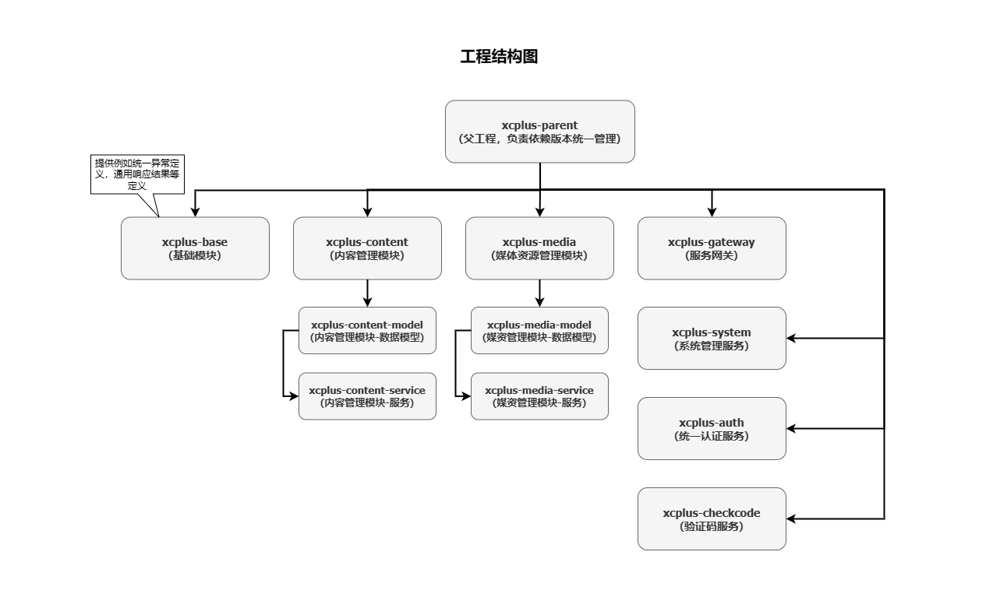

---
## 内容管理模块
### 需求分析
+ 课程基本信息管理：包括新课程的创建、课程的更新、课程的查询；
+ 课程分类管理：课程分类的创建、课程分类树状层级关系维护、树状课程分类查询；
+ 课程教学计划管理：树状层级课程计划的创建、树状层级课程计划查询、课程计划修改删除；
+ 教学计划与媒体资源绑定管理：某一节教学计划与对应视频关系的绑定；
+ 课程发布管理：课程的预发布、教师端提交课程审核、运营端对课程进行审核、审核通过后教师端进行课程的发布；
### 课程基本信息管理功能
#### 数据模型

#### 接口定义
**课程信息分页查询接口定义：**
```http
POST /content/course/list?pageNo=2&pageSize=1
Content-type: application/json

{
    "auditStatus": "202002",
    "courseName": ""
}

## 响应结果
{
    "items": [
        {}
    ],
    "counts": 23,
    "page": 2,
    "pageSize":1
}
```
**课程分类查询接口示例：**
```http
请求 URL: http://localhost:8601/api/content/course-category/tree-nodes
请求方法: GET

响应：
[
    {
        "childrenTreeNodes" : [],
        "id" : "1-1",
        "isLeaf" : null,
        "isShow" : null,
        "label" : "前端开发",
        "name" : "前端开发",
        "orderby" : 1,
        "parentid" : "1"
    },
】
```

**新增课程接口示例：**

```http
POST /content/course

{
   "charge":"201000",
   "price":"10",
   "qq":"123",
   "wechat":"123",
   "phone":"123",
   "validDays":365,
   "mt":"1-3",
   "st":"1-3-2",
   "name":"Spring5源码解析",
   "pic":"",
   "teachmode":"200002",
   "users":"Java初级程序员",
   "tags":"Spring",
   "grade":"204003",
   "objectives":"",
   "uiCategoryTreeSelected":[
      "1-3",
      "1-3-2"
   ],
   "description":"满一航老师精品打造",
   "originalPrice":"100"
}

## 响应
{
   "id":109,
   "companyId":1,
   "companyName":null,
   "name":"测试课程103",
   "users":"初级人员",
   "tags":"",
   "mt":"1-1",
   "mtName":null,
   "st":"1-1-1",
   "stName":null,
   "grade":"204001",
   "teachmode":"200002",
   "description":"",
   "pic":"",
   "createDate":"2022-09-08 07:35:16",
   "changeDate":null,
   "createPeople":null,
   "changePeople":null,
   "auditStatus":"202002",
   "status":1,
   "coursePubId":null,
   "coursePubDate":null,
   "charge":"201000",
   "price":null,
   "originalPrice":0,
   "qq":"",
   "wechat":"",
   "phone":"",
   "validDays":365
}
```

**修改课程回调信息接口示例：**
```http
GET /content/course/118

#响应结果
#{
# "id": 40,
# "companyId": 1232141425,
# "companyName": null,
# "name": "SpringBoot核心",
# "users": "Spring Boot初学者",
# "tags": "Spring项目的快速构建",
# "mt": "1-3",
# "mtName": null,
# "st": "1-3-2",
# "stName": null,
# "grade": "200003",
# "teachmode": "201001",
# "description": "课程系统性地深度探讨 Spring Boot 核心特性，引导小伙伴对 Java 规范的重
视，启发对技术原理性的思考，掌握排查问题的技能，以及学习阅读源码的方法和技巧，全面提升研发能力，
进军架构师队伍。",
# "pic": "https://cdn.educba.com/academy/wp-content/uploads/2018/08/SpringBOOT-Interview-questions.jpg",
# "createDate": "2019-09-10 16:05:39",
# "changeDate": "2022-09-09 07:27:48",
# "createPeople": null,
# "changePeople": null,
# "auditStatus": "202004",
# "status": "203001",
# "coursePubId": 21,
# "coursePubDate": null,
# "charge": "201001",
# "price": 0.01
#}
```

**修改课程接口请求示例：**
```http
PUT /content/course

request: updateCourseDto
response: CourseBaseInfoDto
```

**新增课程计划接口请求示例：**
```http
POST /content/teachplan

# 请求体
{
    "courseId": 117,
    "parentid": 0,
    "grade": 1,
    "pname": "新章名称 [点击修改]"
}

```

### 功能开发

**编写dto类：** 课程的分页查询请求参数与do类型不一致，因此需要额外编写dto类型
```Java
@Data
public class CourseBaseQueryParamDto {
    private String courseName;
    private String auditStatus;
    private String publishStatus;
} 
```

**解决浏览器跨域问题——使用CORS过滤器：**
```Java
@Configuration
public class WebMvcConfig implements WebMvcConfigurer {
    public void addCorsMappings(CorsRegistry registry) {
        registry.addMapping("/**");
    }
}
```

**Mybatis-plus分页插件：**
```Java
@Configuration
@MapperScan("com.example.xcpluscontentservice.mapper")
public class MybatisPlusConfig {
    @Bean
    public MybatisPlusInterceptor mybatisPlusInterceptor() {
        MybatisPlusInterceptor interceptor = new MybatisPlusInterceptor();
        interceptor.addInnerInterceptor(new PaginationInnerInterceptor());
        return interceptor;
    }
}
```

**集成swagger：**
第一步：添加stater swagger pom 依赖
```xml
<!-- https://mvnrepository.com/artifact/com.spring4all/swagger-spring-boot-starter -->
<dependency>
    <groupId>com.spring4all</groupId>
    <artifactId>swagger-spring-boot-starter</artifactId>
    <version>2.0.2.RELEASE</version>
</dependency>
```

**统一异常处理：**
第一步：定义业务通用异常
```Java
public class XueChengCommonException extends RuntimeException {
    public XueChengCommonException (String errMsg) {
        super(errMsg);
    }
}
```

第二步：定义业务异常枚举信息类
```Java
public enum ExceptionEnum {
    UNKNOWN_ERR("未知错误");
    private String errMsg;

    public String getErrMsg() {
        return errMsg;
    }

    ExceptionEnum(String errMsg) {
        this.errMsg = errMsg;
    }
}
```

第三步：定义Controller的全局ExceptionHandler

第四步：定义异常响应json格式
```Java
@Data
@AllArgsConstructor
@NoArgsConstructor
public class ExceptionResponse {
    private String errMessage;
}
```

**使用JSR303框架进行参数校验：**
第一步：引入pom依赖
```xml
<!-- https://mvnrepository.com/artifact/org.springframework.boot/spring-boot-starter-validation -->
<dependency>
    <groupId>org.springframework.boot</groupId>
    <artifactId>spring-boot-starter-validation</artifactId>
    <version>2.7.9</version>
</dependency>
```

第二步：定义约束
```Java
@Data
public class AddCourseDto {

 @NotEmpty(message = "课程名称不能为空")
 private String name;
 
 // ...
}
```

第三步：启用校验
```Java
@ApiOperation("新增课程接口")
@PostMapping("/content/course")
public CourseBaseInfoDto createNewCourse(@RequestBody @Validated AddCourseDto dto) {
    return courseBaseInfoService.addCourseBaseInfo(dto);
}
```

第四步：全局异常处理
```Java
    @ExceptionHandler(MethodArgumentNotValidException.class)
    @ResponseStatus(HttpStatus.BAD_REQUEST)
    public ExceptionResponse handleValidationException(MethodArgumentNotValidException e) {
        String errMessage = "";
        for (FieldError fieldError : e.getFieldErrors()) {
            errMessage += fieldError.getDefaultMessage() + " ";
        }
        ExceptionResponse exceptionResponse = new ExceptionResponse(errMessage);
        return exceptionResponse;
    }
```

----
## 媒资管理模块

### 需求分析
提供媒体资源的统一管理，需求如下：
+ 媒体资源文件的上传、查询、预览、分页列表查询功能；
+ 大文件的断点续传功能；
+ 视频统一转码为mp4格式：教师上传的视频文件可能有多种格式（avi、mov等），浏览器一般默认支持MP4视频的播放，因此需要将这些教学视频进行转码处理；

### 数据模型

### 业务流程

### 项目开发-注册中心Nacos搭建

**服务注册-快速入门：**
第一步：docker运行nacos服务
第二步：父工程配置SpringCloud与Nacos Discovery版本
```xml
<properties>
    <java.version>1.8</java.version>
    <nacos-discovery.version>2021.1</nacos-discovery.version>
    <spring-cloud.version>2021.0.5</spring-cloud.version>
</properties>


    <dependencyManagement>
    <dependencies>
        <!-- https://mvnrepository.com/artifact/com.alibaba.cloud/spring-cloud-starter-alibaba-nacos-discovery -->
        <dependency>
            <groupId>com.alibaba.cloud</groupId>
            <artifactId>spring-cloud-starter-alibaba-nacos-discovery</artifactId>
            <version>${nacos-discovery.version}</version>
        </dependency>
        <!--对SpringCloud相关组件依赖进行版本管理-->
        <dependency>
            <groupId>org.springframework.cloud</groupId>
            <artifactId>spring-cloud-dependencies</artifactId>
            <version>${spring-cloud.version}</version>
            <type>pom</type>
            <scope>import</scope>
        </dependency>
    </dependencies>
</dependencyManagement>
```

第三步：子工程引入SpringCloud核心依赖与Nacos Discovery依赖
```xml
<!-- https://mvnrepository.com/artifact/com.alibaba.cloud/spring-cloud-starter-alibaba-nacos-discovery -->
<dependency>
    <groupId>com.alibaba.cloud</groupId>
    <artifactId>spring-cloud-starter-alibaba-nacos-discovery</artifactId>
</dependency>
<!--SpringCloud核心包-->
<dependency>
    <groupId>org.springframework.cloud</groupId>
    <artifactId>spring-cloud-context</artifactId>
</dependency>
```

第四步：配置子工程Nacos信息（注意要在bootstrap.yml中进行配置，因为要拉取云端配置）
第五步：使bootstrap.yml配置有效，引入spring-cloud-bootstrap依赖
```xml
<dependency>
    <groupId>org.springframework.cloud</groupId>
    <artifactId>spring-cloud-starter-bootstrap</artifactId>
</dependency>
```


**配置文件三要素：**

1. namespace
2. group
3. data_id：`[应用名]-[环境].[文件后缀  ]`

**配置中心-快速入门：**
第一步：Nacos平台创建配置文件（注意命名空间、组与文件命名格式）

第二步：父工程管理Nacos Config依赖版本
```xml
    <properties>
        <spring-cloud.version>2021.0.5</spring-cloud.version>
    </properties>

    <dependency>
        <groupId>com.alibaba.cloud</groupId>
        <artifactId>spring-cloud-starter-alibaba-nacos-config</artifactId>
        <version>${nacos-config.version}</version>
    </dependency>
```

第三步：子工程导入Nacos Config依赖
```xml
<dependency>
    <groupId>com.alibaba.cloud</groupId>
    <artifactId>spring-cloud-starter-alibaba-nacos-config</artifactId>
</dependency>
```
第四步：子工程配置Nacos Config三要素
```yaml
      # 配置Nacos Config三要素
      config:
        namespace: ${spring.profiles.active} 
        group: "xuecheng-project"
        file-extension: yaml
```

**配置中心-创建共享配置：** 有些基础配置是所有模块公用的，例如日志配置、接口文档配置等
子工程进行Nacos Config配置：
```yml
      # 配置Nacos Config三要素
      config:
        namespace: ${spring.profiles.active}
        group: "xuecheng-project"
        file-extension: yaml
        # 公共配置文件读取
        shared-configs:
          - data-id: swagger-${spring.profiles.active}.yaml
            group: "xuecheng-common"
            refresh: true
```

**配置文件优先级：** 默认云端配置文件 > 拓展云端配置文件 > 共享云端配置文件 > 本地配置文件，但是可以通过在云端设置不覆盖的选项（即`override-none=true`）来提高本地配置优先级；

### 项目开发-网关模块搭建
**网管搭建-快速入门：**
步骤一：引入依赖【Nacos, Config, cloud-context, cloud-bootstrap, cloud-starter-gateway, cloud-loadbalancer】
```xml
<dependency>
            <groupId>org.springframework.cloud</groupId>
            <artifactId>spring-cloud-starter</artifactId>
        </dependency>

        <dependency>
            <groupId>org.springframework.cloud</groupId>
            <artifactId>spring-cloud-starter-bootstrap</artifactId>
        </dependency>

        <dependency>
            <groupId>com.alibaba.cloud</groupId>
            <artifactId>spring-cloud-starter-alibaba-nacos-discovery</artifactId>
        </dependency>

        <dependency>
            <groupId>com.alibaba.cloud</groupId>
            <artifactId>spring-cloud-starter-alibaba-nacos-config</artifactId>
        </dependency>

        <dependency>
            <groupId>org.springframework.cloud</groupId>
            <artifactId>spring-cloud-starter-gateway</artifactId>
        </dependency>

        <dependency>
            <groupId>org.springframework.cloud</groupId>
            <artifactId>spring-cloud-starter-loadbalancer</artifactId>
        </dependency>
    </dependencies>
```

步骤二：网关相关配置
```yml
server:
  port: 63010
spring:
  cloud:
    gateway:
      routes:
        - id: content-service
          uri: lb://content-service/
          predicates:
            - name: Path
              args:
                pattern: /content/**
```

### 项目开发-文件系统模块搭建

**MinIO分布式文件系统快速入门：** 
+ [快速入门官方文档](https://min.io/docs/minio/linux/developers/java/minio-java.html)
+ [minio启动一直卡在add local minio host](https://bootschool.net/article/62fa0463f301192a03817e2d/minio-docker-log-adding-local-minio-host-to-mc-configuration)

第一步：引入MinIO Java SDK 依赖
```xml
        <dependency>
            <groupId>io.minio</groupId>
            <artifactId>minio</artifactId>
            <version>8.5.2</version>
        </dependency>
```

第二步：配置客户端
```Java
@Configuration
public class MinIOConfig {
    @Bean
    public MinioClient minioClient(@Value("${minio.endpoint}") String endpoint,
                                   @Value("${minio.accessKey}") String accessKey,
                                   @Value("${minio.secretKey}") String secretKey) {
        return MinioClient.builder()
                .endpoint(endpoint)
                .credentials(accessKey, secretKey)
                .build();
    }
}
```

第三步：使用客户端进行文件上传


**数据模型：**
```SQL
-- 媒资信息 
-- auto-generated definition
create table media_files
(
    id           varchar(32)             not null comment '文件id,md5值'
        primary key,
    company_id   bigint                  null comment '机构ID',
    company_name varchar(255)            null comment '机构名称',
    filename     varchar(255)            not null comment '文件名称',
    file_type    varchar(12)             null comment '文件类型（图片、文档，视频）',
    tags         varchar(120)            null comment '标签',
    bucket       varchar(128)            null comment '存储目录',
    file_path    varchar(512)            null comment '存储路径',
    file_id      varchar(32)             not null comment '文件id',
    url          varchar(1024)           null comment '媒资文件访问地址',
    username     varchar(60)             null comment '上传人',
    create_date  datetime                null comment '上传时间',
    change_date  datetime                null comment '修改时间',
    status       varchar(12) default '1' null comment '状态,1:正常，0:不展示',
    remark       varchar(32)             null comment '备注',
    audit_status varchar(12)             null comment '审核状态',
    audit_mind   varchar(255)            null comment '审核意见',
    file_size    bigint                  null comment '文件大小',
    constraint unique_fileid
        unique (file_id) comment '文件id唯一索引 '
)
    comment '媒资信息' charset = utf8mb3;
```

**请求接口：**
```http
POST http://localhost:8602/api/media/upload/coursefile

filedata: (二进制)
```

**接口定义：**
```Java
@RequestMapping("/media/upload/coursefile")
public MediaFilesDto uploadFile(@RequestParam MultipartFile file,
                                @RequestParam(required = false) String folder,
                                @RequestParam(required = false) String objectName) {
    return null;
}
```
```Java

```

**通用文件上传接口优化——抽取代码与事务优化：** 
抽取代码的原因：
1. 将文件上传到文件系统和将上传信息入库是两个不同的且内聚的业务逻辑，之后可能有别的业务分离的调用这两种业务，所以应当进行抽取；
2. 方便Spring进行事务管理，事务管理的粒度应当尽量地小，尽量只管理数据库的部分（文件上传部分需要网络，高并发时压力过大，效率会很慢，不应当进行事务管理）；

抽取代码的方法（单文件内）：先写一个比较长的方法，然后根据业务将具体的代码进行抽取（使用`Ctrl + Alt + M` 快捷键）

事务管理代码：注意Spring的特性，带有`@Transactional`注解的方法只有被当作代理对象调用时事务管理才会生效；

<font color = green>DONE: Spring如何解决自依赖的代理注入过程？看满老师的课就知道，代理对象创建的时机有两种，一种是初始化之后，一种是实例化之后（依赖注入前），而后者会在有循环依赖的时候进行，从而解决代理对象诸如问题</font>

### 项目开发-上传视频业务

**断点续传**：对于很大的文件（例如视频），如果用户上传过程中网络波动，导致连接断开，下次用户再传时需要重新开始，则体验会非常差，因此使用断点续传技术；

**断点续传业务流程：**
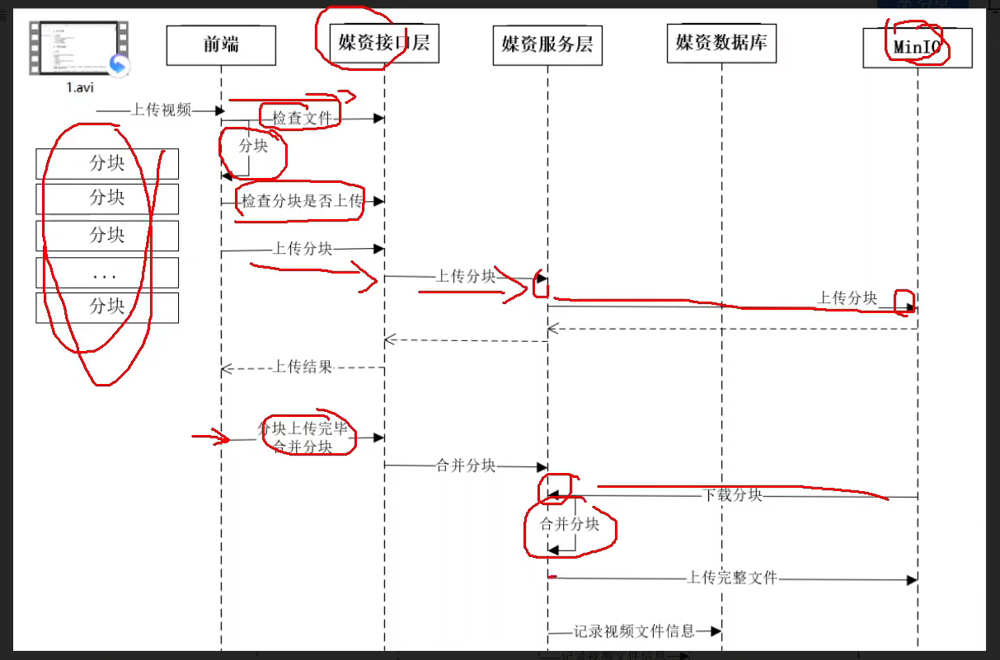

**断点续传接口定义：**
```http
POST media/upload/checkfile

fileMd5: c828090f61d5e3adce9af44562018f6e
```

```http
POST media/upload/checkchunk

fileMd5: c828090f61d5e3adce9af44562018f6e
chunk: 0
```

```http
POST media/upload/uploadchunk

file: (二进制)
fileMd5: c828090f61d5e3adce9af44562018f6e
chunk: 0
```

```http
POST media/upload/mergechunks

fileMd5: c828090f61d5e3adce9af44562018f6e
fileName: Apex Legends 2023-01-22 16-18-38.mp4
chunkTotal: 13
```

### 项目开发-视频转码功能
**分布式任务调度：** 使用分布式技术来进行任务调度的技术叫做分布式任务调度，即使用多台机器，确保按照原先预设时间的任务能够定时执行；
分布式任务调度需要考虑监控问题（如何知道哪些机器的任务正常跑完，哪些没有），也需要解决重复执行问题（避免多台及其收到重复的调度指令）；

**XXL-JOB分布式任务调度：**
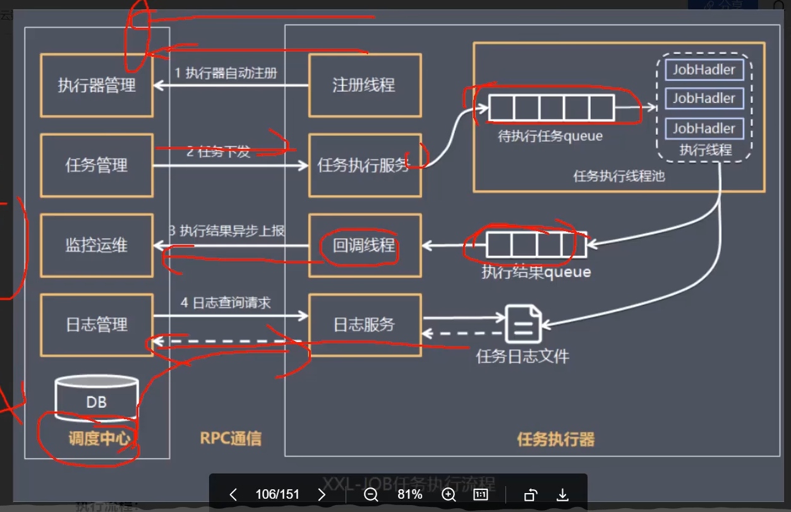

**XXL-JOB 快速入门：** [XXL-JOB快速入门](https://www.xuxueli.com/xxl-job/#2.1%20%E5%88%9D%E5%A7%8B%E5%8C%96%E2%80%9C%E8%B0%83%E5%BA%A6%E6%95%B0%E6%8D%AE%E5%BA%93%E2%80%9D)
第一步：下载项目源码，获取初始化SQL脚本并执行
第二步：docker部署xxl-job，初始化参数需指定数据库配置（参考官网命令）
第三步：引入Java-sdk
```xml
<dependency>
    <groupId>com.xuxueli</groupId>
    <artifactId>xxl-job-core</artifactId>
    <version>${xxl-job-core.version}</version>
</dependency>
```
第四步：根据xxl-job demo配置config与handler


**FFMPEG 快速入门：**
第一步：引入本地依赖
```xml
```

**任务调度策略：**
+ 随机、轮询、哈希、...
+ 分片广播策略：会让每个机器拿到分片编号与分片总个数，使得多台机器协作执行；

**XXL-JOB 分片广播 快速入门：**

**需求分析：** 非mp4视频需要通过转码转成mp4视频，从而实现在线预览的功能；因此需要任务调度去处理这些尚未处理的视频；

**视频处理-分片作业方案：**
1. 视频上传时，针对非mp4视频会额外存储到media_process表（表示需要进行转码处理）；
2. 每隔一段时间进行任务调度，在数据库中寻找（数量=核心数）条数据，并对原始视频进行转码处理；
3. 上传转码后的视频，并将原始视频的url设置为转码后视频的url；

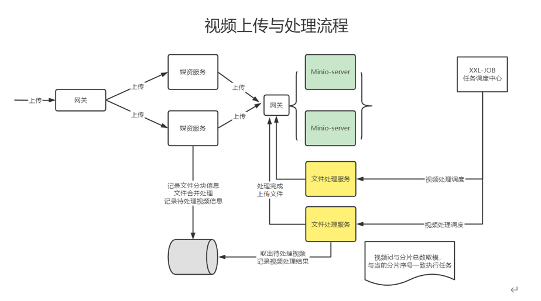  

### 媒资绑定功能
**数据模型定义：** 需要一个新的课程计划-媒资关系表，记录二者的绑定关系；
```sql
-- auto-generated definition
create table teachplan_media
(
    id             bigint auto_increment comment '主键'
        primary key,
    media_id       varchar(32)  null comment '媒资文件id',
    teachplan_id   bigint       not null comment '课程计划标识',
    course_id      bigint       not null comment '课程标识',
    media_fileName varchar(150) not null comment '媒资文件原始名称',
    create_date    datetime     null,
    create_people  varchar(60)  null comment '创建人',
    change_people  varchar(60)  null comment '修改人'
)
    collate = utf8mb4_general_ci;
```

**接口定义：**
```http
POST content/teachplan/association/media

{
  "mediaId": "807cecaa7e895514f407970ffc6c8b10",
  "fileName": "02-概述-分库分表是什么.avi",
  "teachplanId": 283
}
```

**单元测试：**

**接口自测：**

---
## 课程发布

### 项目开发-课程预览功能
**freemarker:** 模板引擎，目标是将长期不变的页面转换成静态页面，从而减小服务端访问压力（例如在本课程中，将课程预览页面转换为静态页面并保存）；

常见的java模板引擎技术有：Jsp, Freemarker等；

**freemarker快速入门：**
第一步：引入spring-boot-starter-freemarker依赖：
```xml
<dependency>
    <groupId>org.springframework.boot</groupId>
    <artifactId>spring-boot-starter-freemarker</artifactId>
    <version>${spring-boot-starter-freemarker.version}</version>
</dependency>
```

第二步：spring-boot配置：（一般采用默认配置即可）
```yml
spring:
  freemarker:
    suffix: ".ftl"
    template-loader-path: "classpath:/template/" #本地freemarker视图文件目录
    cache: false #取消本地缓存
    charset: UTF-8 #设置UTF-8编码
    enabled: true #使用MVC方案解决freemarker
    content-type: text/html #将freemarker视图文件渲染成html页
```

第三步：在`classpath:/template/`目录下放入ftl文件
```ftl
<!DOCTYPE html>
<html>
<head>
    <meta charset="utf-8">
    <title>Hello World!</title>
</head>
<body>
Hello ${name}!
</body>
</html>
```

第四步：编写接口，并返回ModelAndView数据
```Java
@Controller
@Slf4j
@Api("freemarker测试控制器")
public class FreemarkerTestController {

    @GetMapping("/content/test")
    public ModelAndView testFreemarker() {
        ModelAndView modelAndView = new ModelAndView();
        // 1.准备视图数据
        modelAndView.setViewName("test");

        // 2.准备模型数据
        modelAndView.addObject("name", "张三");

        return modelAndView;
    }

}

```

第五步：单元测试
```Java
@SpringBootTest
@AutoConfigureMockMvc
class FreemarkerTestControllerTest {
    @Autowired
    MockMvc mockMvc;

    @Test
    void testFreemarker() throws Exception {
        MvcResult mvcResult = mockMvc.perform(MockMvcRequestBuilders.get("/content/test")).andReturn();
        String s = new String(mvcResult.getResponse().getContentAsByteArray(), StandardCharsets.UTF_8);
        System.out.println(s);
    }
}
```

**页面静态化部署（使用Nginx）-快速入门：** 将门户页面（页面样式、html）等静态页面部署到Nginx中；

第一步：docker部署Nginx：（使用宗卷挂载替换配置文件与静态文件）
```shell
docker run --privileged --name some-nginx -v D:\Codes\learning\资料\学成在线项目-资料\nginx-volume\nginx.conf:/etc/nginx/nginx.conf:ro -v D:\Codes\learning\资料\学成在线项目-资料\nginx-volume\xc-ui-pc-static-portal:/usr/share/nginx/xc-ui-pc-static-portal:ro -p 80:80 -d nginx

docker run --name some-nginx\
 -v localmachine/nginx.conf:/etc/nginx/nginx.conf:ro\
 -p 81:81\
 -d nginx
```

第二步：配置nginx.conf文件，配置静态资源映射
```conf
http {
    server {
        listen       81;
        server_name  localhost;

        location / {
		#定义别名，设置资源根路径
		alias  /usr/share/nginx/xc-ui-pc-static-portal/;
            index  index.html index.htm;
        }

        #静态资源
        location /static/img/ {  
                alias  /usr/share/nginx/xc-ui-pc-static-portal/img/;
        } 
        location /static/css/ {  
                alias   /usr/share/nginx/xc-ui-pc-static-portal/css/;
        } 
        #...
    }
}
```

第三步：更改本地host映射文件：127.0.0.1 www.51xuecheng.cn

**Nginx反向代理-快速入门：**
[docker nginx 访问宿主机服务](https://stackoverflow.com/questions/42438381/docker-nginx-proxy-to-host)
第一步：配置nginx.conf文件，加入后台网关upstream，并配置路由策略
```conf
http {

  upstream fileserver{
    server 127.0.0.1:9000 weight=10;
  } 
   #后台网关
  upstream gatewayserver{
    server host.docker.internal:63010 weight=10;
  } 
   #前端开发服务
  upstream uidevserver{
    server 127.0.0.1:8602 weight=10;
  } 


    server {
        listen       80;
        server_name  www.51xuecheng.cn localhost;

        location / {
		#定义别名，设置资源根路径
		alias  /usr/share/nginx/xc-ui-pc-static-portal/;
            index  index.html index.htm;
        }

	#api
        location /api/ {
                proxy_pass http://gatewayserver/;
        } 
    }
}      
```

第二步：配置二级域名
```config
server {
    listen       80;
    server_name  file.51xuecheng.cn;
    #charset koi8-r;
    ssi on;
    ssi_silent_errors on;
    #access_log  logs/host.access.log  main;
    location /video {
        proxy_pass   http://fileserver;
    }

    location /mediafiles {
        proxy_pass   http://fileserver;
    }
}
```


**接口定义-课程预览：**
```http
GET /content/coursepreview/120
```

**门户页面调用流程：**
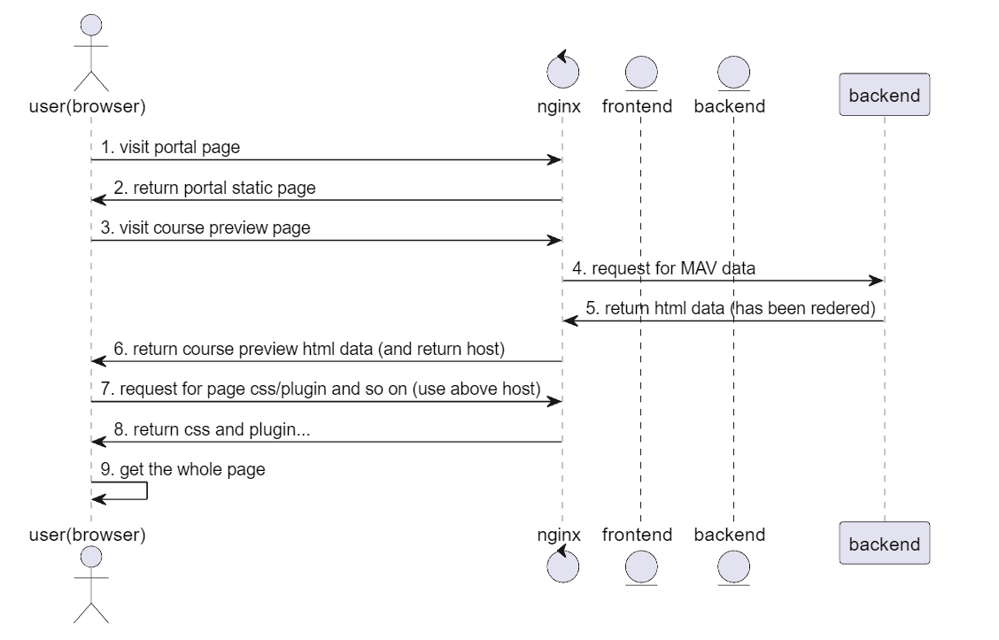

### 项目开发-课程审核功能

**课程状态流转图：**
课程发布状态：

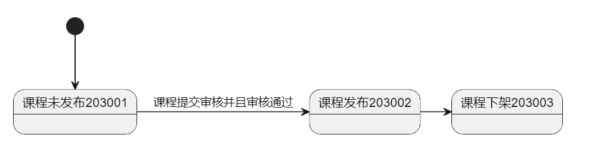

课程审核状态：
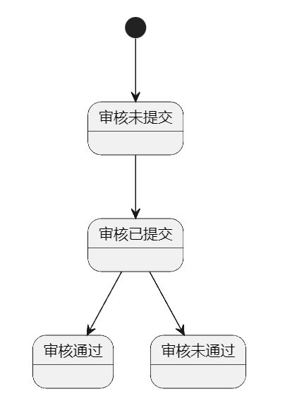

**数据模型：**
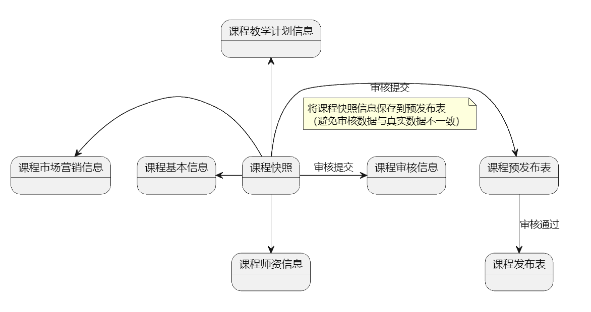

**接口定义：**
```http
POST content/courseaudit/commit/120
```

### 项目开发-课程发布功能
**需求分析：**
1. 课程预览界面变化度不高，且信息量大，且访问量也大，如何减少db压力 ？ -> 生成静态页面保存到MinIO中；
2. 如何快速搜索课程 -> 使用ES生成全文索引
3. 课程缓存信息 -> redis；
4. 如何保证上面几步同时执行或取消？ -> 分布式事务

**分布式事务：**
通过网络通信去调用不同的服务去完成事务叫做分布式事务；

CAP理论：一致性、可用性、分区一致性；

判断当前项目是AP项目还是CP项目：
+ CP项目：强一致性，例如跨行转账；
+ AP项目：可以有延迟的一致性，最终一致性；

BASE理论：
+ 基本可用：
+ 软状态：
+ 最终一致性

**业务流程：**
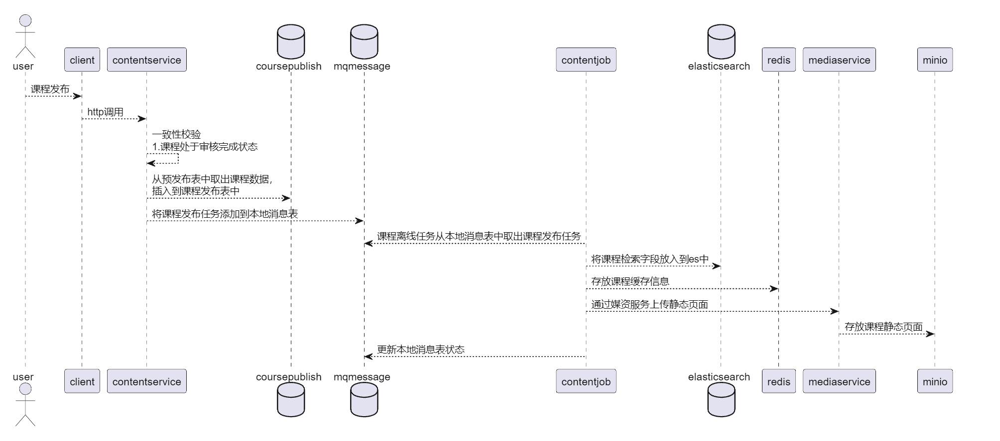
**消息处理通用SDK开发思路：**
SDK接口：
```Java
pubilc abstarct class MqMessageUtil {
    public MqMessageUtil (
        int count; //取出多少任务
        String type; //要取出的任务类型
        int shard; //当前机器分片编号
        int total; //总机器数量
        @Nullable int threadNum; //任务执行并发度
    ) {}

    abstarct process(MqMessage message);//抽象方法，每一个任务如何处理 
} 
```

**页面静态化-快速入门：**
```Java
    public void test_generate_static_page_for_course_preview() throws Exception{
        // 获取模板
        InputStream resourceAsStream = this.getClass().getResourceAsStream("/templates/course_template.ftl");
        InputStreamReader inputStreamReader = new InputStreamReader(resourceAsStream);
        Template t = new Template("course_template.ftl", inputStreamReader);

        // 获取数据
        CoursePreviewDto coursePreviewDto = new CoursePreviewDto();
        CourseBaseInfoDto courseBaseInfo = courseBaseInfoService.getCourseBaseInfo(new Long(120));
        coursePreviewDto.setCourseBase(courseBaseInfo);
        List<TeachPlanDto> teachPlanByCourseId = teachPlanInfoService.getTeachPlanByCourseId(new Long(120));
        coursePreviewDto.setTeachplans(teachPlanByCourseId);

        HashMap<String, Object> map = new HashMap<>();
        map.put("model", coursePreviewDto);

        // 根据模板和数据生成html文件（字符串形式）
        String s = FreeMarkerTemplateUtils.processTemplateIntoString(t, map);

        // 将html字符串写入到文件
        FileOutputStream fileOutputStream = new FileOutputStream("D:\\Codes\\learning\\资料\\学成在线项目-资料\\120.html");
        IOUtils.copy(IOUtils.toInputStream(s, "utf-8"), fileOutputStream);
    }
```

**Feign远程调用：** 因为内容管理模块需要将静态预览页面上传到minio，因此需要远程调用媒资服务的接口，故使用Feign进行远程调用；

**Feign-快速入门：** [Feign快速入门](https://docs.spring.io/spring-cloud-openfeign/docs/3.1.7-SNAPSHOT/reference/html/)


**熔断降级：** 在一个微服务链路中，存在上下游调用关系，如果一个请求由于下游的服务不可用，导致自身无效的链接堆积，从而导致整个链路服务不可用，这个叫做熔断现象；在链路发生熔断时，我们应当提供降级链路，以降级服务代替原来的下游服务，这种策略叫做服务降级；
**熔断降级-快速入门：**
第零步：引入openfeign依赖和netflix-hystrix依赖
```xml
<dependency>
    <groupId>org.springframework.cloud</groupId>
    <artifactId>spring-cloud-starter-netflix-hystrix</artifactId>
    <version>2.2.10.RELEASE</version>
</dependency>
```
第一步：开启熔断降级策略
```xml  
feign:
  client:
    config:
      default:
        connectTimeout: 5000
        readTimeout: 5000
  circuitbreaker:
    enabled: true
```

第二步：设置降级策略（当超时或者调用异常时就会走降级策略）
```Java
@FeignClient(value = "media-service", fallbackFactory = MediaServiceFallBackFactory.class)
public interface MediaServiceClient {
    @RequestMapping(value = "/media/upload/coursefile", consumes = {MediaType.MULTIPART_FORM_DATA_VALUE})
    MediaFilesDto uploadFile(@RequestPart("filedata") MultipartFile filedata,
                                    @RequestParam(required = false) String folder,
                                    @RequestParam(required = false) String objectName);
}
```
```Java
@Component
@Slf4j
public class MediaServiceFallBackFactory implements FallbackFactory<MediaServiceClient> {

    @Override
    public MediaServiceClient create(Throwable cause) {
        return new MediaServiceClient() {
            @Override
            public MediaFilesDto uploadFile(MultipartFile filedata, String folder, String objectName) {
                log.error("媒资服务调用异常：{}", cause);
                return null;
            }
        };
    }
}

```
### 项目开发-搜索模块搭建
**全文检索技术：** 使用分词技术将文章分词 -> 对每个词建立倒排索引；
**业务流程：** 课程发布后通过消息处理方式创建索引；
**elasticsearch 8.x 与kibanada搭建：**  [搭建流程](https://www.elastic.co/guide/en/elasticsearch/reference/8.6/docker.html)
+ elasticsearch：搜索服务；
+ kibana：es 可视化平台；

第一步：使用`./bin/elasticsearch-create-enrollment-token -s kibana`命令创建token；
第二步：使用`./bin/elasticsearch-reset-password -u elastic`命令重置elastic用户的密码
```shell
token:
eyJ2ZXIiOiI4LjYuMSIsImFkciI6WyIxNzIuMTguMC4yOjkyMDAiXSwiZmdyIjoiZmRiNzBjYTk0YzI0NDU0Y2FhZjk2ZDY5Mzc0MjRjNGFiMGQxMTk0NmM1NDJmMDg0ZWU5ZjYyZGI5MmQyYzY3NSIsImtleSI6InFYd0JBNGNCT2gycnhNUUtCOVNVOmN2WXZ1dUpUU2tLVTNPSUp2T0lxMncifQ==

username: elastic 
password: qfd*66KB=Ds3Vw5=HBJi
```

第三步：查看`/elasticsearch/config/elasticsearch.yml`确认证书配置

通过`localhost:5601/app/dev_tools#/console`访问kibana控制台；


**IK分词器安装：** [宿主机向docker传送文件](https://blog.csdn.net/eyexin2018/article/details/124041673)，[elasticsearch安装IK分词器](https://blog.csdn.net/sdfadfsdf/article/details/107466784)

使用命令` docker cp D:\CodeTools\elasticsearch-analysis-ik-8.6.1 0fd415c3f078:/usr/share/elasticsearch/plugins/ik`将宿主机下载ik分词器拷贝到es插件目录；

注意ik分词器版本与es版本要一一致；

**创建课程信息索引：**
```json
PUT /course-publish
{
  "settings": {
    "number_of_shards": 1,
    "number_of_replicas": 0
  },
  "mappings": {
    "properties": {
      "id": {
        "type": "keyword"
      },
      "companyId": {
        "type": "keyword"
      },
      "companyName": {
        "analyzer": "ik_max_word",
        "search_analyzer": "ik_smart",
        "type": "text"
      },
      "name": {
        "analyzer": "ik_max_word",
        "search_analyzer": "ik_smart",
        "type": "text"
      },
      "users": {
        "index": false,
        "type": "text"
      },
      "tags": {
        "analyzer": "ik_max_word",
        "search_analyzer": "ik_smart",
        "type": "text"
      },
      "mt": {
        "type": "keyword"
      },
      "mtName": {
        "type": "keyword"
      },
      "st": {
        "type": "keyword"
      },
      "stName": {
        "type": "keyword"
      },
      "grade": {
        "type": "keyword"
      },
      "teachmode": {
        "type": "keyword"
      },
      "pic": {
        "index": false,
        "type": "text"
      },
      "description": {
        "analyzer": "ik_max_word",
        "search_analyzer": "ik_smart",
        "type": "text"
      },
      "createDate": {
        "format": "yyyy-MM-dd HH:mm:ss",
        "type": "date"
      },
      "status": {
        "type": "keyword"
      },
      "remark": {
        "index": false,
        "type": "text"
      },
      "charge": {
        "type": "keyword"
      },
      "price": {
        "type": "scaled_float",
        "scaling_factor": 100
      },
      "originalPrice": {
        "type": "scaled_float",
        "scaling_factor": 100
      },
      "validDays": {
        "type": "integer"
      }
    }
  }
}
```

**spring集成elasticsearch：** 使用[Elastisearch Java API Client(8.x版本)](https://www.elastic.co/guide/en/elasticsearch/client/java-api-client/current/connecting.html) 进行Java调用；
第一步：maven依赖
```xml
<dependency>
    <groupId>co.elastic.clients</groupId>
    <artifactId>elasticsearch-java</artifactId>
    <version>8.6.2</version>
</dependency>

<dependency>
    <groupId>com.fasterxml.jackson.core</groupId>
    <artifactId>jackson-databind</artifactId>
    <version>2.12.3</version>
</dependency>

<dependency>
    <groupId>jakarta.json</groupId>
    <artifactId>jakarta.json-api</artifactId>
    <version>2.0.1</version>
</dependency>
```

第二步：配置SSL连接（附带证书）
```Java
@Configuration
public class EsConfig {
    @Bean
    public ElasticsearchClient elasticsearchClient() throws IOException {
        // ca证书位置，通过elasticsearch.yml文件查看证书配置
        // 将证书复制到本机可访问的位置
        File certFile = new File("D:\\CodeTools\\http_ca.crt");

        SSLContext sslContext = TransportUtils
                .sslContextFromHttpCaCrt(certFile);

        BasicCredentialsProvider credsProv = new BasicCredentialsProvider();
        credsProv.setCredentials(
                AuthScope.ANY, new UsernamePasswordCredentials("elastic", "dVjXAPv0yxxvoxxCNdp=")
        );

        RestClient restClient = RestClient
                .builder(new HttpHost("localhost", 9200, "https"))
                .setHttpClientConfigCallback(hc -> hc
                        .setSSLContext(sslContext)
                        .setDefaultCredentialsProvider(credsProv)
                )
                .build();

// Create the transport and the API client
        ElasticsearchTransport transport = new RestClientTransport(restClient, new JacksonJsonpMapper());
        ElasticsearchClient client = new ElasticsearchClient(transport);
        return client;
    }
}

```
第三步：编写单元测试文件：
```Java
/**
 * 测试Spring工程链接elasticsearch
 */
@SpringBootTest
public class ElasticsearchTest {
    @Autowired
    ElasticsearchClient client;

    @Test
    public void test_get_course_index() throws Exception{
        SearchResponse<CourseIndex> search = client.search(s -> s
                        .index("course-publish")
                        .query( q -> q.match( t -> t.field("name").query("Java"))
                        ),
                CourseIndex.class);

        for (Hit<CourseIndex> hit: search.hits().hits()) {
            System.out.println(hit.source());
        }
    }

}
```
---
## 认证授权
### 模块需求分析
**什么是认证授权？**
+ 认证：告诉系统你的身份；
+ 鉴权：判断用户是否具有访问某个资源的权限；


### Spring Security
**认证授权测试：**
**Spring Security工作原理：**
**Spring Security认证系统搭建 - 快速入门：**
第一步：引入security依赖
```xml
<!--父工程管理版本-->
<dependencymanagement>
    <dependency>
    <groupId>org.springframework.cloud</groupId>
    <artifactId>spring-cloud-security-dependencies</artifactId>
    <version>2.2.4.RELEASE</version>
    <type>pom</type>
    <scope>import</scope>
</dependency>
</dependencymanagement>
```
```xml
<dependency>
    <groupId>org.springframework.cloud</groupId>
    <artifactId>spring-cloud-starter-security</artifactId>
</dependency>
<dependency>
    <groupId>org.springframework.cloud</groupId>
    <artifactId>spring-cloud-starter-oauth2</artifactId>
</dependency>
```
第二步：编写访问测试控制器
```java
@RestController
public class TestController {
    @GetMapping("/r1")
    @PreAuthorize("hasAuthority('r1')") //权限控制，需要有r1权限才能访问该资源
    public RestResponse<Boolean> r1() {
        System.out.println("这是测试资源r1");
        return RestResponse.success(true);
    }

    @GetMapping("/r2")
    @PreAuthorize("hasAuthority('r2')") //权限控制，需要有r2权限才能访问该资源
    public RestResponse<Boolean> r2() {
        System.out.println("这是测试资源r2");
        return RestResponse.success(true);
    }
}
```
第三步：mock内存级用户
```Java
@Configuration
//开启全局资源访问权限控制
@EnableGlobalMethodSecurity(securedEnabled = true, prePostEnabled = true)
public class SecurityConfiguration extends WebSecurityConfigurerAdapter {

    @Autowired
    PasswordEncoder passwordEncoder;

    /**
     * 使用内存级别用户服务mock用户信息，测试使用
     * @return
     */
    @Bean
    @Override
    protected UserDetailsService userDetailsService() {
        InMemoryUserDetailsManager manager = new InMemoryUserDetailsManager();

        manager.createUser(User.withUsername("张三")
                .password(passwordEncoder.encode("123"))
                .authorities("r1")
                .build());

        manager.createUser(User.withUsername("李四")
                .password(passwordEncoder.encode("123"))
                .authorities("r2")
                .build());

        return manager;
    }

    /**
     * 配置密码编码器，这里使用标准编码器
     */
    @Bean
    public PasswordEncoder passwordEncoder() {
        return new BCryptPasswordEncoder();
    }
}
```
**OAuth2授权码模式与对应测试postman:**
参数介绍：
1. client_id: 客户端id，认证中心颁发的唯一标识；
2. client_secret：客户端密钥
3. scope：客户端权限
4. redirect_uri：授权码模式使用的跳转uri

第一步：请求授权码：
```http
POST /oauth/authorize?client_id=&response_type=code&scope=&redirect_uri=
```
+ client_id：客户端id，由认证中心分配；
+ response_type：值为code，表示要求返回授权码；
+ scope：授权范围；
+ redirect_uri：授权页面uri；

第二步：用户同意授权，获取授权码
```http
http://xxxx?code=?????
```
+ code：对应的授权码

第三步：请求令牌
```http
/oauth/token?
client_id=&
client_secret=&
grant_type=authorization_code&
code=xxxxx&
redirect_uri=
```
+ client_id：客户端id
+ client_secret：客户端密钥
+ grant_type：authorization_code，表示根据授权码获取token请求类型；
+ code：授权码
+ redirect_uri：

第四步：获取令牌结果

**spring security整合OAuth2与jwt - 服务器快速搭建** [教程](https://cloud.tencent.com/developer/article/1916126)
总共要配置三部分，一是security的基本配置（例如密码加密方式等），而是OAuth认证中心服务相关配置，三是令牌相关配置，总体结构如下：


第一步：Spring Security配置
+ 配置加密方式：Encoder
+ 配置基本用户：方便测试
+ 配置认证管理器：AuthenticationManager，用于密码授权码模式；
+ 配置安全拦截策略：授权码模式需要使用表单提交模式，因此需要开启拦截策略；
```Java
@Configuration
//开启全局资源访问权限控制
@EnableGlobalMethodSecurity(securedEnabled = true, prePostEnabled = true)
public class SecurityConfiguration extends WebSecurityConfigurerAdapter {

    @Autowired
    PasswordEncoder passwordEncoder;

    /**
     * 使用内存级别用户服务mock用户信息，测试使用
     * @return
     */
    @Bean
    @Override
    protected UserDetailsService userDetailsService() {
        InMemoryUserDetailsManager manager = new InMemoryUserDetailsManager();

        manager.createUser(User.withUsername("张三")
                .password(passwordEncoder.encode("123"))
                .authorities("r1")
                .build());

        manager.createUser(User.withUsername("李四")
                .password(passwordEncoder.encode("123"))
                .authorities("r2")
                .build());

        return manager;
    }

    /**
     * 配置密码编码器，这里使用标准编码器
     */
    @Bean
    public PasswordEncoder passwordEncoder() {
        return new BCryptPasswordEncoder();
    }

    /**
     * 配置安全管理器，用于密码授权码模式使用
     */
    @Bean
    public AuthenticationManager authenticationManager() throws Exception{
        return super.authenticationManagerBean();
    }

    /**
     * 配置安全拦截器
     */
    @Override
    protected void configure(HttpSecurity http) throws Exception {
        http.authorizeHttpRequests()
                .anyRequest().authenticated()
                .and()
                .formLogin()
                .loginProcessingUrl("/login")
                .permitAll()
                .and()
                .csrf()
                .disable();
    }
}

```

第二步：令牌相关配置
+ 配置令牌存储位置：通常有redis存储和jwt令牌两种形式；
+ 配置令牌服务：令牌服务用于进行令牌的创建、获取、刷新等操作；
```Java
@Configuration
public class JwtTokenConfig {
    /**
     * 配置jwt转换器，设置签名私钥
     */
    @Bean
    public JwtAccessTokenConverter jwtAccessTokenConverter() {
        JwtAccessTokenConverter jwtAccessTokenConverter = new JwtAccessTokenConverter();
        jwtAccessTokenConverter.setSigningKey("xuecheng");
        return jwtAccessTokenConverter;
    }

    /**
     * 配置token存储对象
     */
    @Bean
    public TokenStore tokenStore(JwtAccessTokenConverter jwtAccessTokenConverter) {
        return new JwtTokenStore(jwtAccessTokenConverter);
    }

    @Bean
    public ClientDetailsService clientDetailsService() {
        return new InMemoryClientDetailsService();
    }

    /**
     * 配置令牌管理服务
     */
    @Bean
    public AuthorizationServerTokenServices tokenServices(TokenStore tokenStore) {
        DefaultTokenServices service = new DefaultTokenServices();
        //配置客户端信息
        service.setClientDetailsService(clientDetailsService());
        //支持令牌的刷新
        service.setSupportRefreshToken(true);
        //设置令牌存储服务
        service.setTokenStore(tokenStore);
        //设置token过期时间
        service.setAccessTokenValiditySeconds(60*60*2);
        //设置refresh_token的过期时间
        service.setRefreshTokenValiditySeconds(60*60*24*3);
        return service;
    }
}

```


第三步：配置OAuth2.0：
+ 对客户端详情信息进行配置：`ClientDetailsServiceConfigurer`，因为不是所有客户端都有权限向认证中心申请令牌，因此需要配置客户端的id、密钥、权限等；
+ 授权码服务配置：使用授权码模式需要配置一个授权码服务，用于颁布和删除授权码；
+ 配置令牌访问端点：即配置`/oauth/token, /oauth/authorize`等这类的请求对应的控制器；
+ 令牌访问安全约束配置：对端点权限进行配置？

```Java
@Configuration
@EnableGlobalAuthentication
public class OAuth2Config extends AuthorizationServerConfigurerAdapter {
    @Override
    public void configure(AuthorizationServerSecurityConfigurer security) throws Exception {
        security
                //开启/oauth/token_key端口权限访问验证
                .tokenKeyAccess("permitAll()")
                //开启/oauth/check_token端口认证权限访问验证
                .checkTokenAccess("permitAll()")
                //支持client_id和client_secret做登录认证
                .allowFormAuthenticationForClients();
    }

    /**
     * 配置客户端详情信息，告诉认证中心有哪些客户端可以申请令牌，以及他们有哪些权限
     * @param clients
     * @throws Exception
     */
    @Override
    public void configure(ClientDetailsServiceConfigurer clients) throws Exception {
        //将客户端详情信息配置在内存中
        clients.inMemory()
                //配置客户端id
                .withClient("content-service")
                //配置客户端密钥
                .secret(new BCryptPasswordEncoder().encode("xuecheng"))
                //能够访问哪些资源的id集合
                .resourceIds()
                //设置授权模式（总共四种），这里我们设置为授权码模式
                .authorizedGrantTypes("authorization_code")
                //定义客户端的权限
                .scopes()
                //是否自动授权，false表示需要用户点击进行授权
                .autoApprove(false)
                //授权码返回的地址
                .redirectUris("http://www.baidu.com");
    }

    /**
     * 配置授权码服务，用于进行授权码的颁发和删除
     * @return
     */
    @Bean
    public AuthorizationCodeServices authorizationCodeServices() {
        return new InMemoryAuthorizationCodeServices();
    }

    @Autowired
    AuthenticationManager authenticationManager;
    @Autowired
    AuthorizationServerTokenServices tokenServices;

    @Override
    public void configure(AuthorizationServerEndpointsConfigurer endpoints) throws Exception {
        endpoints
                //配置授权码模式对应的授权码服务
                .authorizationCodeServices(authorizationCodeServices())
                //配置授权码模式所需要的管理器
                .authenticationManager(authenticationManager)
                //配置令牌管理服务
                .tokenServices(tokenServices)
                //只允许POST提交访问令牌
                .allowedTokenEndpointRequestMethods(HttpMethod.POST);
    }
}

```

**spring security整合OAuth2与jwt - 资源服务器快速搭建：**
第一步：OAuth2.0配置，配置当前项目为资源服务器
```Java
@Configuration
@EnableResourceServer
@EnableGlobalMethodSecurity(prePostEnabled = true, securedEnabled = true, jsr250Enabled = true)
public class ResourceServerConfig extends ResourceServerConfigurerAdapter {
}
```

第二步：配置令牌服务，设置客户端id、密钥等；

**资源服务整合Spring Security:**
**获取用户身份：**

### OAuth2协议
**为什么要使用OAuth2协议：** 用于获取第三方系统的资源信息，因此诞生了这么一款安全的资源认证授权访问协议；

**OAuth2协议认证的流程：**
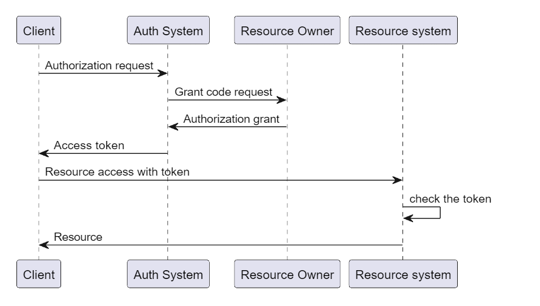

### JWT令牌

**普通令牌的问题：** 每次请求资源都需要认证服务校验令牌的合法性，性能低下；

**jwt令牌：** 特点如下：
+ 无状态性：token的校验与服务器无关，不像传统token需要在session域或者redis中保存token信息，jwt令牌可以只通过令牌本身进行校验；
+ 三部分组成：
  + 头部：包含jwt令牌加密信息；
  + 用户信息：包含一些拓展的用户信息，例如用户名等；
  + 签名：为前两者的签名信息，服务端保存签名私钥；

**jwt令牌认证流程：**
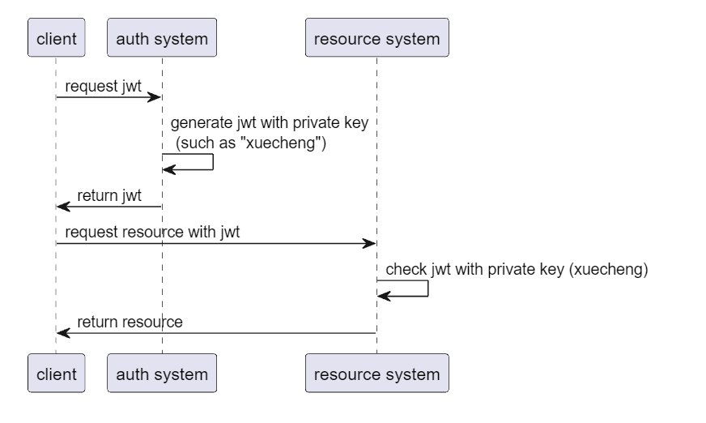

### 网关统一认证
**网关的职责：**
1. 路由转发；
2. jwt令牌的认证；
3. 白名单的维护（维护哪些URL不需要进行认证）；

**网关统一认证搭建 - 快速入门：**
第一步：配置token存储方式，设置为jwt令牌
```Java
@Configuration
public class TokenConfig {

    String SIGNING_KEY = "xuecheng";


//    @Bean
//    public TokenStore tokenStore() {
//        //使用内存存储令牌（普通令牌）
//        return new InMemoryTokenStore();
//    }

    @Autowired
    private JwtAccessTokenConverter accessTokenConverter;

    @Bean
    public TokenStore tokenStore() {
        return new JwtTokenStore(accessTokenConverter());
    }

    @Bean
    public JwtAccessTokenConverter accessTokenConverter() {
        JwtAccessTokenConverter converter = new JwtAccessTokenConverter();
        converter.setSigningKey(SIGNING_KEY);
        return converter;
    }


}
```

第二步：设置安全拦截配置，要求对所有请求进行令牌校验
```Java
 @EnableWebFluxSecurity
 @Configuration
 public class SecurityConfig {


  //安全拦截配置
  @Bean
  public SecurityWebFilterChain webFluxSecurityFilterChain(ServerHttpSecurity http) {

   return http.authorizeExchange()
           .pathMatchers("/**").permitAll()
           .anyExchange().authenticated()
           .and().csrf().disable().build();
  }


 }

```

第三步：设置web拦截器，配置白名单（读取白名单，对白名单直接放行，对非白名单请求进行令牌校验）
```Java
@Component
@Slf4j
public class GatewayAuthFilter implements GlobalFilter, Ordered {
    @Override
    public Mono<Void> filter(ServerWebExchange exchange, GatewayFilterChain chain) {
        String requestUrl = exchange.getRequest().getPath().value();
        AntPathMatcher pathMatcher = new AntPathMatcher();
        //白名单放行
        for (String url : whitelist) {
            if (pathMatcher.match(url, requestUrl)) {
                return chain.filter(exchange);
            }
        }

        //检查token是否存在
        String token = getToken(exchange);
        if (StringUtils.isBlank(token)) {
            return buildReturnMono("没有认证",exchange);
        }
        //判断是否是有效的token
        OAuth2AccessToken oAuth2AccessToken;
        try {
            oAuth2AccessToken = tokenStore.readAccessToken(token);

            boolean expired = oAuth2AccessToken.isExpired();
            if (expired) {
                return buildReturnMono("认证令牌已过期",exchange);
            }
            return chain.filter(exchange);
        } catch (InvalidTokenException e) {
            log.info("认证令牌无效: {}", token);
            return buildReturnMono("认证令牌无效",exchange);
        }

    }
}
```

### 自定义用户服务
**连接用户数据库：**
```java
/**
 * 自定义UserDetailService，为spring security提供自定义的用户获取方法
 */
@Service
public class UserServiceImpl implements UserDetailsService {
    @Autowired
    XcUserMapper xcUserMapper;

    /**
     * 根据用户名称加载用户信息
     * @param username 用户名
     * @return 用户的详情信息
     * @throws UsernameNotFoundException
     */
    @Override
    public UserDetails loadUserByUsername(String username) throws UsernameNotFoundException {
        XcUser xcUser = xcUserMapper.selectOne(new LambdaQueryWrapper<XcUser>().eq(XcUser::getUsername, username));

        // 如果用户为null，直接返回null即可，spring security会封装异常
        if (xcUser == null) {
            return null;
        }

        // 如果用户不为null，则封装成UserDetail并返回
        return User.withUsername(username).password(xcUser.getPassword()).build();
    }
}

```

**拓展jwt用户信息：** 拓展思路有两个，一个是拓展UserDetails对象，增添自定义的字段；二是使用框架原始的UserDetail对象，但是存储username时我们存储拓展信息；

```Java
// 封装用户拓展信息
xcUser.setPassword(null);
String user = JSON.toJSONString(xcUser);

return User.withUsername(user).password(password).authorities(authorities).build();
```

### 统一认证入口
**需求分析：** 需要增强当前的spring security认证服务，提供多样化认证方式，出去原始的密码认证，也需要支持微信认证、手机验证码认证等；

**创建统一认证请求参数：**
```Java
@Data
public class AuthParamsDto {
    /**
     * 用户名密码验证参数
     */
    private String username;
    private String password;

    /**
     * 收集验证码验证参数
     */
    private String phone;
    private String code;

    //验证类型：{password: 密码模式, sms: 验证码模式}
    private String authType;
}

```

**自己提供校验支持，取消spring security默认密码校验逻辑** 因为认证方式有多种，例如扫码验证、手机验证码验证等，不是每一种认证方式都需要进行密码校验，而spring security默认的校验器`DaoAuthenticationProvider`会使用密码校验模式，我们应当取消这种默认校验方式；
```Java
/**
 * @author Mr.M
 * @version 1.0
 * @description 重写了DaoAuthenticationProvider的校验的密码的方法，因为我们统一认证入口，有一些认证方式不需要校验密码
 * @date 2023/2/24 11:40
 */
@Component
public class DaoAuthenticationProviderCustom extends DaoAuthenticationProvider {

 @Autowired
 public void setUserDetailsService(UserDetailsService userDetailsService) {
  super.setUserDetailsService(userDetailsService);
 }

 @Override
 protected void additionalAuthenticationChecks(UserDetails userDetails, UsernamePasswordAuthenticationToken authentication) throws AuthenticationException {
     //这里置空，表示不走框架的任何校验逻辑
 }
}

```

告诉框架使用自定义的校验提供器：
```Java
@EnableWebSecurity
@EnableGlobalMethodSecurity(securedEnabled = true,prePostEnabled = true)
public class WebSecurityConfig extends WebSecurityConfigurerAdapter {
    @Autowired
    DaoAuthenticationProviderCustom daoAuthenticationProviderCustom;


    @Override
    protected void configure(AuthenticationManagerBuilder auth) throws Exception {
        auth.authenticationProvider(daoAuthenticationProviderCustom);
    }

}
```

**自定义校验服务：**
自定义校验服务接口：
```Java
/**
 * 自定义校验服务，提供校验支持
 */
public interface AuthService {
    /**
     * 执行校验逻辑
     * @param dto
     * @return
     */
    boolean authenticate(AuthParamsDto dto);
}

```

```Java
/**
 * 用户名密码模式校验服务实现
 */
@Component("password_auth_service")
public class PasswordAuthServiceImpl implements AuthService {
    @Override
    public boolean authenticate(AuthParamsDto dto) {
        return false;
    }
}

```

在UserServiceImpl中进行用户校验：
```Java
@Service
public class UserServiceImpl implements UserDetailsService {
    @Autowired
    ApplicationContext applicationContext;

    /**
     * 根据用户名称加载用户信息
     * @param authParams 认证参数信息
     * @return 用户的详情信息
     * @throws UsernameNotFoundException
     */
    @Override
    public UserDetails loadUserByUsername(String authParams) throws UsernameNotFoundException {
        //反序列化获取认证参数
        AuthParamsDto params = null;
        try {
            params = (AuthParamsDto) JSON.parse(authParams);
        } catch (Exception e) {
            throw new RuntimeException("认证参数反序列化失败");
        }

        //进行校验
        String serviceBeanName = params.getAuthType() + "_auth_service";
        AuthService authService = (AuthService) applicationContext.getBean(serviceBeanName);
        authService.authenticate(params);

        //...
    }
```

**使用postman进行测试：**
```http
### 密码模式，请求AuthParamsDto参数
POST http://localhost:63070/auth/oauth/token?client_id=XcWebApp&client_secret=XcWebApp&grant_type=password&username={"username":"t1","password":"111111","authType":"password"}
```

**自定义认证服务前后spring security认证流程的变化：**
spring security原始认证流程：
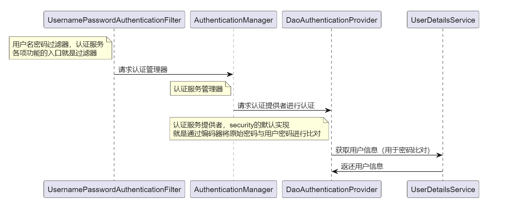

自定义认证服务流程：
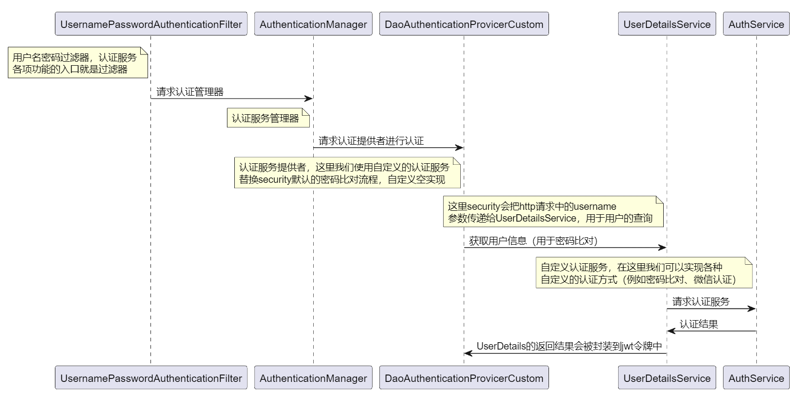

**验证码微服务：** 因为用户名密码认证方式每一次认证都会访问数据库，因此可能会有各种脚本攻击（例如CSRF跨站请求伪造攻击等），因此我们需要验证码操作将脚本类的行为提前拦截；

### 微信扫码认证
**微信扫码认证流程（OAuth2.0）:**

**微信二维码app id申请：**
**扫码后授权码接口回调**